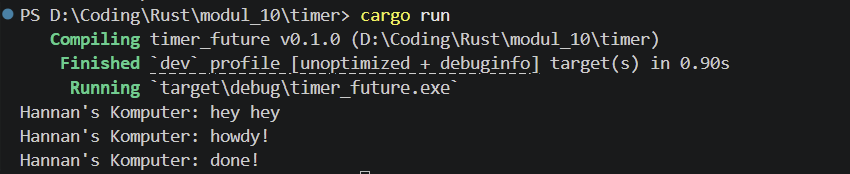
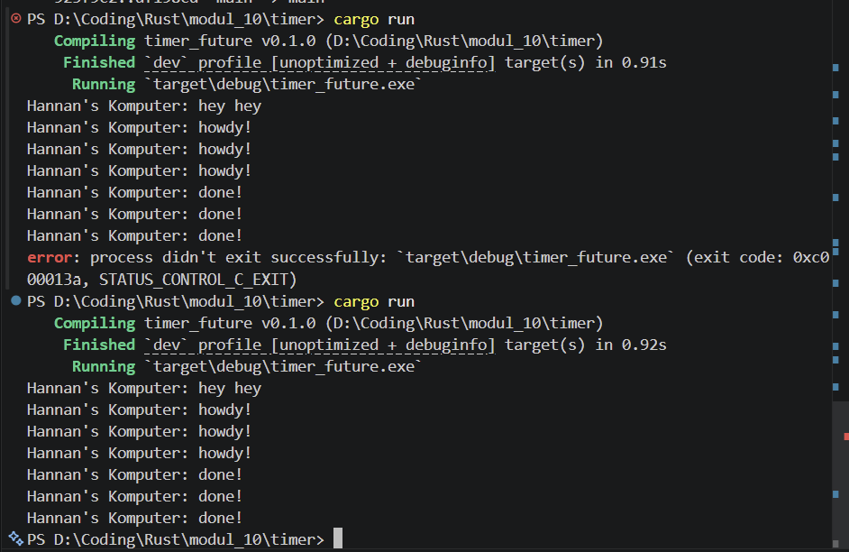

## 1.2 Understanding how it works

Ini terjadi karena spawner menyimpan task tersebut dan hanya akan di eksekusi ketika command `execute.run()` dijalankan. Sehingga karena `println!("Hannan's Komputer: hey hey");` dijalankan sebelum `execute.run()`, maka pada console muncul `Hannan's Komputer: hey hey` terlebih dahulu sebelum task yang di spawn dengan spawner.

## 1.3 Multiple Spawn and removing drop 

Pada `cargo run` pertama, kode dijalankan tanpa menggunakan `drop(spawner)` tidak akan berhenti, harus force exit (pada gammbar menggunakan CTRL + C).  
Pada `cargo run` kedua, kode dijalankan dengan menggunakan `drop(spawner)` berhenti karena eksekutor tau spawner sudah selesai dan tidak akan menerima task lagi.