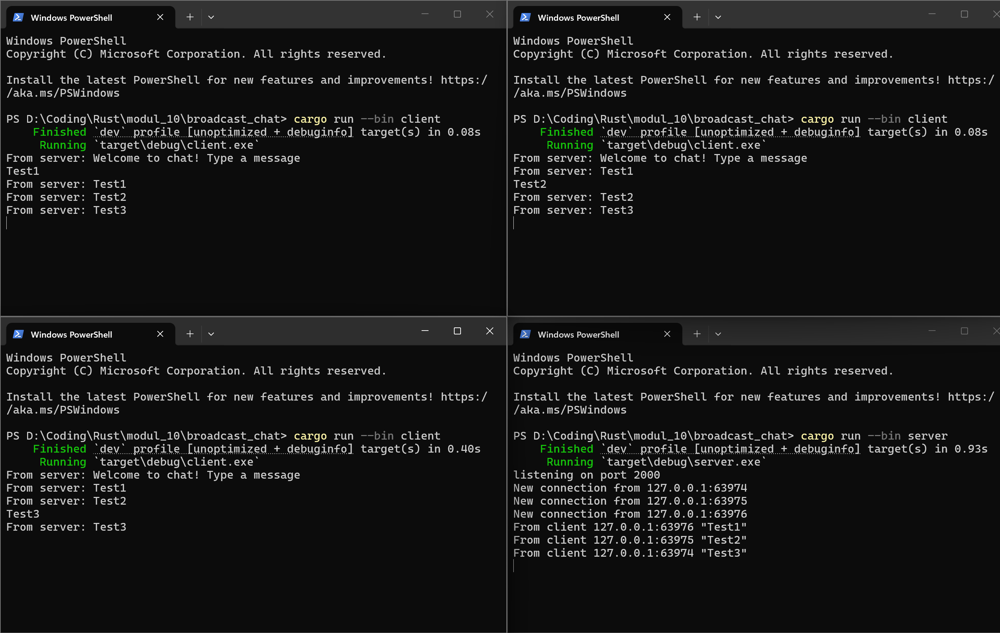
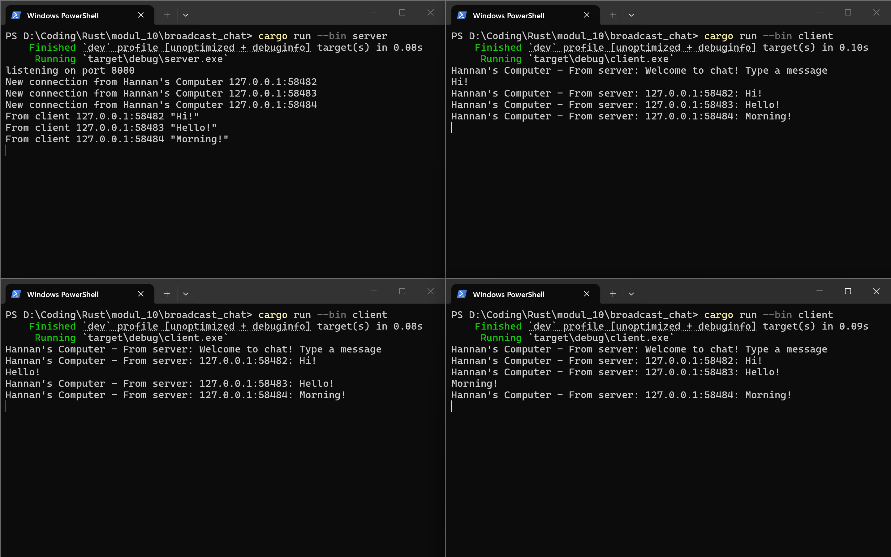

## 2.1 Original code of broadcast chat



**Server**
Server dijalankan dan mendengarkan koneksi di port 2000, lalu server menerima tiga koneksi baru dari alamat lokal dengan port yang berbeda. Server menampilkan message yang dikirim oleh client secara real-time.

**Client**
Client dijalankan dan terhubung dengan server dan menerima welcome message. Message yang dikirim baik dari client1, client2, maupun client3 akan diterima dari masing-masing client juga.

## 2.2 Modifying the websocker port

Ya, di file `server.rs` juga menggunakan websocket protocol. Websocket protocol didefinisikan di dalam `tokio::spawn`, tepatnya di `let (_req, ws_stream) = ServerBuilder::new().accept(socket).await?;`. Baris tersebut adalah proses websocket handshake. Handshake itu sendiri adalah proses negosiasi di antara dua device atau sistem yang akan menerapkan aturan dalam berkomunikasi dan memvalidasi sinyal untuk memastikan jalur komunikasi aman dan kedua device tersebut dalam kondisi siap. Fungsi dari websocket handshake  adalah mengubah/ menerapkan koneksi jaringan biasa (TCP) menjadi koneksi dua arah yang interaktif (websocket).

## 2.3 Small changes. Add some information to client



Di file `server.rs`, ada dua perubahan yang dilakukan:
1. 
```rust
                        if let Some(text) = msg.as_text() {
                            println!("From client {addr:?} {text:?}");
                            let formatted_msg = format!("{addr}: {text}");
                            bcast_tx.send(formatted_msg)?;
                        }
```
Perubahan disini diubah di bagian pengiriman, kita mengirim tidak hanya text tapi juga addressnya juga. Sehingga client bisa mengirim addressnya juga.

2.
```rust
    loop {
        let (socket, addr) = listener.accept().await?;
        println!("New connection from Hannan's Computer {addr:?}");
        let bcast_tx = bcast_tx.clone();
        tokio::spawn(async move {
            // Wrap the raw TCP stream into a websocket.
            let (_req, ws_stream) = ServerBuilder::new().accept(socket).await?;

            handle_connection(addr, ws_stream, bcast_tx).await
        });
    }
```

Perubahan disini hanya ada di bagian println! nya saja.

Di file `client.rs`, hanya ada satu perubahan:
1.
```rust
                match incoming {
                    Some(Ok(msg)) => {
                        if let Some(text) = msg.as_text() {
                            println!("Hannan's Computer - From server: {}", text);
                        }
                    },
                    Some(Err(err)) => return Err(err),
                    None => return Ok(()),
                }
```
Perubahan disini ada di bagian println! saja, karena di server sudah mengirim address juga, jadi di client tinggal menerima dan mengoutputnya.